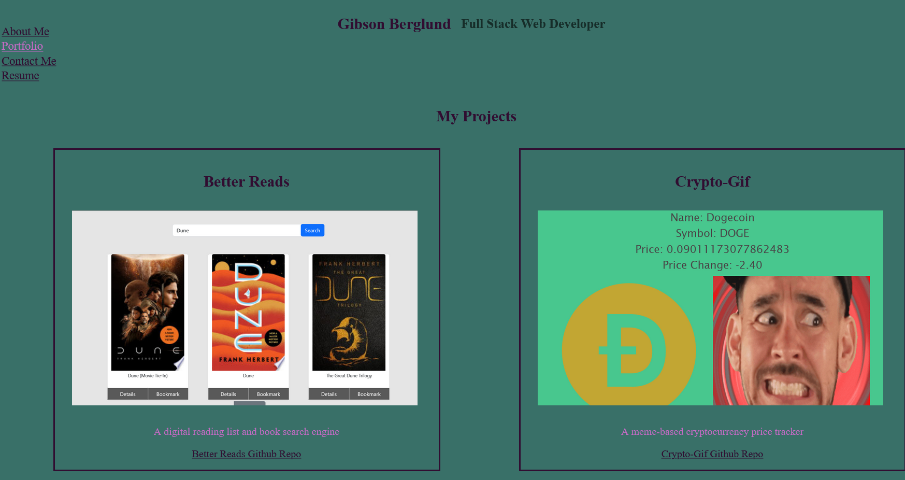

# React Portfolio

## Description
        This application acts as a Web Dev portfolio to show off the applications I have built during the U of MN bootcamp, and to tell potential employees about me and my work history.

## Table of Contents
[Installation](#Installation)
[Usage](#Usage)
[License](#License)
[Credits](#Credits)
[Tests](#Tests)
[Questions](#Questions)

## Installation
        N/A

## Usage
        Simply go to the url and navigate the site using the links in the top left corner.
https://gibsonberglund.github.io/react-portfolio/

## Credits
        U of MN Web Dev Bootcamp

## License
        This application is covered under the MIT License
        Click the link below to learn more about this license:
https://opensource.org/licenses/MIT

## Tests
        N/A

## How To Contribute
        If you would like to make a contribution to this application,
        you can contact the creators at the Github URL or the email address provided in the following section.

## Questions
        If you have any questions about this application, you can find more info at my Github URL here: github.com/gibsonberglund
        Or you can contact me directly at this email address: N/A
    